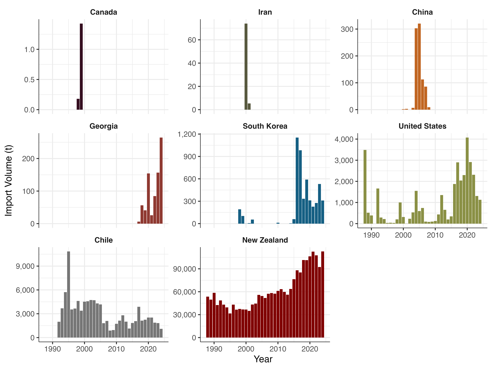
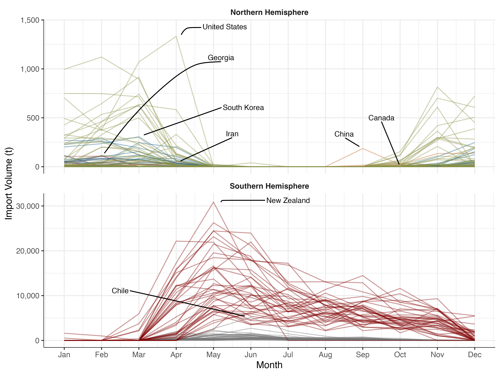
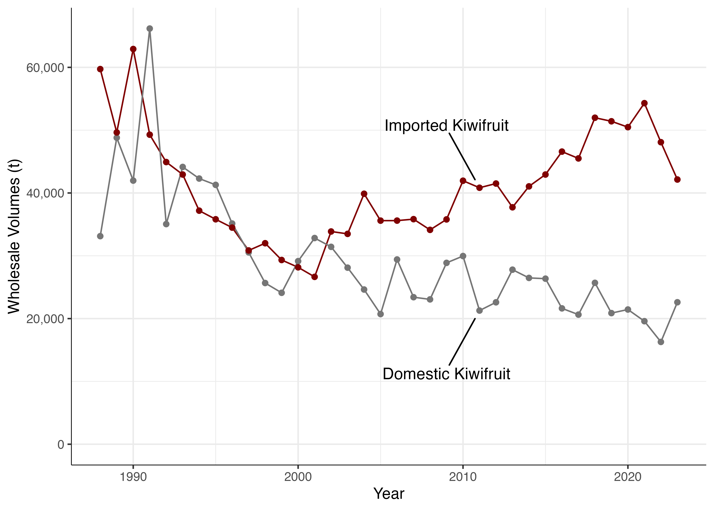
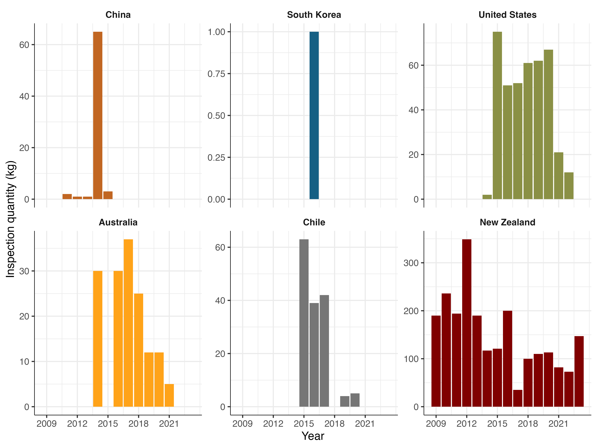

# R Scripts for Figures 1–4 Based on Statistical Data

This repository contains the R scripts used to generate Figures 1 to 4 in the following paper:

Nishimura, T. (2025). Investigating kiwifruit consumer preferences in Japan: Aligning cultivars, origins, and pollen sources. *Q Open*, 5(x), qoaf022. [https://doi.org/10.1093/qopen/qoaf022](https://doi.org/10.1093/qopen/qoaf022)

All figures were created based on statistical data from Japan. Each figure has a corresponding R script that explains how it was generated.

## Figures

### Figures 1 and 2

[R script for Figures 1 and 2](https://takeshinishimura.github.io/QOpen2025/import_volumes_and_value_by_Country.html)

### Figure 3

[R script for Figure 3](https://takeshinishimura.github.io/QOpen2025/wholesale.html)

### Figure 4

[R script for Figure 4](https://takeshinishimura.github.io/QOpen2025/pollen_import.html)
